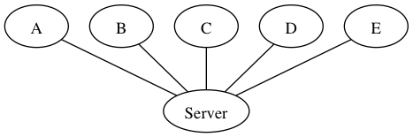
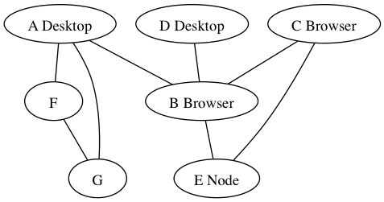
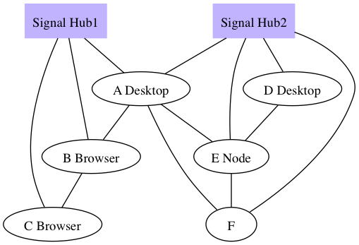
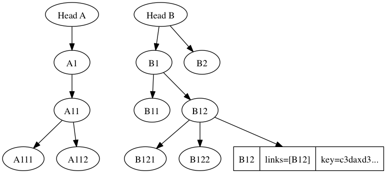

## Aplicaciones distribuidas descentralizadas con JavaScript

[@hugozap](http://twitter.com/hugozap)

## Motivación

- Open Web
- Independencia de servicios y gatekeepers.
- Revivir el espíritu creativo de la web.
- escenarios offline / conexiones intermitentes / etc.

## Multicast ( Red Local )

Capacidad para crear servicios que se anuncien y se
puedan descubrir sin conocer la dirección de la máquina
donde se alojan ( en la red local )

[https://www.npmjs.com/package/airpaste](airpaste)
[https://github.com/mafintosh/multicast-dns](multicast-dns)

```bash
    Terminal A:
    echo "hola" | airpaste
    Terminal B:
    airpaste
    output: hola
```
## Descentralización en varios frentes

* WebRTC (Comunicación entre nodos de Internet)
* IPFS 
* WebTorrent
* Blockchain
*  Ethereum( contratos inteligentes descentralizados)

## P2P y WebRTC

VideoConferencias => Meh...

Data Channels => Yeiii!!

## Centralizado



## Descentralizado



## 1. Estableciendo conexión con otros Peers



## 1. Estableciendo conexión con otros Peers

* No necesariamente me conecto con TODOS (límites de conexiones)
* Necesitamos uno o más nodos que coordinen la conexión (Signal hub)
* Un SignalHub solo presenta peers. 

## 2. Cómo replicar información entre peers? (swarm)



## 2. Cómo replicar información entre peers? (swarm)

* Merkle DAG (Ej => GIT)
* Arquitectura "Append Only Log"
* CambioA puede depender de CambioB y CambioC
* Usamos Hash (shasum256) como llave de cada nodo (verificar integridad)
* Hash(Contenido Del Nodo + Lista de llaves a otros nodos)

## Modularidad al rescate

* hyperlog
* leveldb
* webrtc-swarm
* signalhub

## Kappa Architecture

Kappa Architecture is a software architecture pattern. Rather than using a relational DB like SQL or a key-value store like Cassandra, the canonical data store in a Kappa Architecture system is an append-only immutable log"

[Kappa Architecture](http://milinda.pathirage.org/kappa-architecture.com/)

## Preguntas

@hugozap
hugozap@gmail.com


